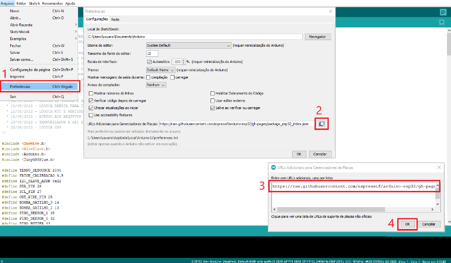
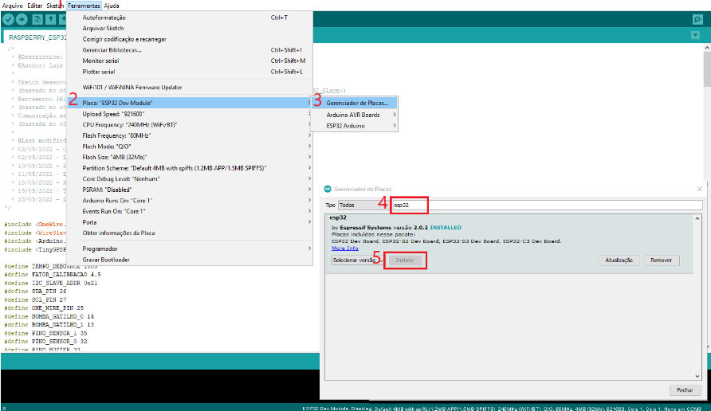
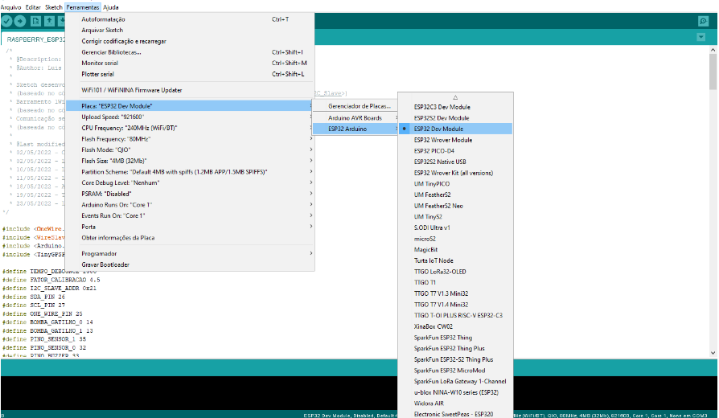

<h1 align="center"> Monitore IOT - TCC </h1>

<p align="center">
Solução baseada no kit de desenvolvimento ESP32 para automação de bombas de abastecimento de combustível em postos internos <br/>
<p align="center">Desenvolvido durante meu Trabalho de Conclusão de Curso</p>

  
<br>

<p align="center">
  
</p>
<p align="center">
    <a href="https://drive.google.com/file/d/1fJzazAKdgJbHsF8TJt_9n712rZ6LjsRO/view?usp=sharing">
    	
    </a>
  </p>
</p>

<p align="center">
	<sub>
		<i>Descrição em Português</i>
	</sub>
</p>

<br>

## 🚀 Tecnologias

Esse projeto foi desenvolvido com as seguintes tecnologias:

### Embarcado:
- ESP32
- C++
- Arduino lib
- TinyGSMClient
- TinyGPSPlus
- ArduinoJSON

### Servidor:
- Prisma
- Fastify

### Web
- React JS
- TypeScript
- ApexCharts
- Zod
- Vite

## 💻 Projeto

O projeto surgiu como uma proposta para apresentar como Trabalho de Conclusão de Curso, no qual foi realizado um estudo dentro do mercado de combustível e postos internos de abastecimento. Viu-se a necessidade de implementar um projeto de baixo custo para realizar a automação do processo de realizar um abastecimento até enviar os dados de telemetria a um serviço remoto, e apresentar os mesmo em uma interface de usuário na WEB.

- Monografia: [Link](https://drive.google.com/file/d/1fJzazAKdgJbHsF8TJt_9n712rZ6LjsRO/view?usp=sharing)
- Documentação ApexCharts: [Link](https://apexcharts.com/)
- Documentação ESP32: [Link](https://pdf1.alldatasheet.com/datasheet-pdf/view/1179101/ESPRESSIF/ESP-WROOM-32.html)
- Documentação React: [Link](https://react.dev/)
- Documentação Fastify: [Link](https://fastify.dev/)

## 🔖 Layout
  
O Layout pode ser encontrado no Figma por meio do seguinte [Link](https://www.figma.com/file/U0GabgBEy9YpTL9NXXSGNM/Monitore?type=design&node-id=0%3A1&mode=design&t=SmIOu03OqksRXHc0-1)

## 🧮 Execução

### IoT
O core do ESP32 deve ser inserido no ambiente IDE Arduino para que seja possível compilar os códigos para os kits de desenvolvimento da Espressif. inserir o link: 
```
https://raw.githubusercontent.com/espressif/arduino-esp32/gh-pages/package_esp32_index.json
```
Seguir os passos para selecionar a placa correta:

<p align="center">
  
  
  
</p>

Em __iot/main/main.ino__ se encontra o código principal que utiliza a biblioteca __FuelPumpAutomation__

### Web

Em __web-vite/__ se encontra o código da aplicação que roda na web. Para iniciar o servidor de desenvolvimento

```
npm run dev
```

### Server

Em __server/__, estão as rotas das APIs que acessam os dados dos usuário do sistema. Para rodar o servidor, executar:

```
npm run dev
```

## ⏯️ Testes

### IoT
- Versão Arduino IDE: 1.8.19
- Versão ESP32: 2.0.2


