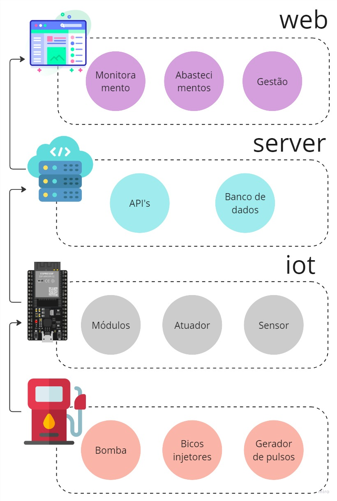

  
  <h2 align="center">TCC - Repositório</h2>
  
Solução baseada no kit de desenvolvimento ESP32 para automação de bombas de abastecimento de combustível em postos internos

  
  

    
  

	
		<i>Descrição em Português</i>
	

 

## Sumário

- [OBSERVAÇÕES](#Inicio)

 

## Observações
### iot
Apresenta o código principal que é inserido no ESP32 para a automação das bombas de combustível. Inclui as bibliotecas necessárias para o código principal em _main_ ser executado corretamente.

### server
Apresenta as rotas das APIs que acessam os dados dos usuário do sistema.

### web
Apresenta o código fonte da apicação de monitoramento.

 
